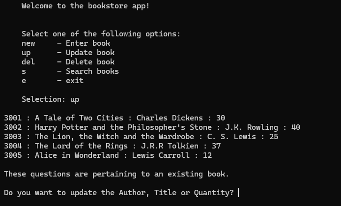

# E-Bookstore App

A command-line Python application for managing a bookstore catalogue, built around a SQLite database. This project demonstrates full CRUD operations and structured menu-driven data management for a clerk-style catalogue tool.

## Screenshots



## Features

- Add, update, delete, and search books in the catalogue
- SQLite-backed persistent storage
- Menu-driven interface designed for clerk-style catalogue management

## Tech Stack

Python, SQLite

## Installation

1. Clone the repository

   ```bash
   git clone https://github.com/SZStanton/E-Bookstore-App
   ```

2. Navigate into the project folder

3. Run the app

   ```bash
   python main.py
   ```
